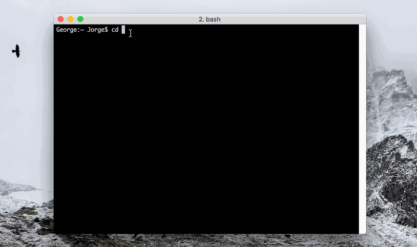

<p align="center">
	
</p>

<br />

### Repository index
- [Welcome to Dotfiles!](#welcome)
- [Installation Guide](#install)
 	- [Dotfiles on your local computer](#install)
 	- [From Google drive (or other cloud service)](#install_cloud)
- [How to: Uninstall Dotfiles](#uninstall)
- [Contribute to this repository](#contribute)
- [New to Dotfiles? Don't be panic!](#newbie)
- [Special thanks](#thanks)
- [Contact](#contact)

#<a name="welcome"></a>Welcome to JF~Dotfiles!


Hi! Welcome to JF~Dotfiles repository. I spent the last two days and half crafting and learning how to make my own Dotfiles. I'm really proud of the result and can't wait to improve them and make more cool features in the following months. If you have some ideas, I'll be happy to open this repository to contributions (read ['how to make suggestions'](#contribute) below).

### What is a Dotfile?

According to [Drew Barontini](http://drewbarontini.com/setup/dotfiles/):
"Dotfiles is a name used to denote a set of configuration files (generally hidden ones with a `.` before the filename) that are used to set up and configure various applications and settings, such as: Bash. Git. Vim. Sublime Text"

### How to automatically install the Dotfiles?

There are two options:

- The first is cloning the repository into your computer and then execute
`install.sh` script.

- One line Installation. Open your terminal and paste the following code:

	```Bash
	git clone https://github.com/ferreiro/dotfiles.git && cd dotfiles && chmod +x dotfiles.sh && ./dotfiles.sh
	```


### Goals with this repository

1. Crafting a program to install easily and comfortably all my mac applications, configuration files and design preferences (Dock, Finder...).
2. Analyzing why Dotfiles are so useful and learn how to make them properly.
3. Making the program easy to understand and open to modification (Choosing a good structure for future improvements, modifications and community improvements).

#<a name="install"></a>Installation Guide

**Note:** Tested on OS X Sierra 10.12.0 and El Capitan 10.11.4 using iMac (Mid 2011) and Mac Book Pro Retina (Early 2015).

### Installing Dotfiles locally




1. Open the **Terminal** app.
	- Option 1. Go to /Applications/Utilities and click on Terminal icon.
	- Option 2. Open spotlight (command ⌘ + space), type "Terminal" and click enter.

2. Clone this repository on your on your /Documents directory and enter to the created directory.

	```Bash
	$ cd /Users/<your_username>/Documents
	$ git clone https://github.com/ferreiro/dotfiles.git
	$ cd dotfiles
	```

3. <a name="install_point3" /> Run `./dotfiles.sh` located on your dotfiles folder.

	```bash
	$ cd /Users/<your_username>/Documents/dotfiles
	$ chmod +x dotfiles.sh && ./dotfiles.sh
	```

4. Menu will be displayed. Type 1, to run the installer.
	```Bash
	1) Install
	2) Uninstall
	3) Update
	4) Quit

	$ Number to execute: 1
	```

5. Enter your password to execute the script as Super User (sudo) and follow the instructions.<br />
	*Note: Sometimes you may need to enter your password again later*

	```Bash
	% Password: <your_computer_password>
	```

Note: After the program finishh (6) you may want to install extra programs from AppStore or configure programs. See configuration guide below:

- Iterm2 ([How to configure using your Dotfiles](api/config/iterm2_profile/README.md))

###<a name="install_cloud"/> Installing Dotfiles using Google Drive

> I recommend you to store your dotfiles on Google Drive (Dropbox, etc...) instead of your local mac.

1. Install Google Drive program for mac.

	```bash
	https://www.google.com/drive/download/
	```

2. Sign in with your account and sync all your files (including your dotfiles folder).
3. If you don't have any previous dotfiles project on your Google Drive, clone this repository on your preferred folder **inside** your Google Drive.

	```bash
	$ cd /Users/<your_username>/Google drive/ # Go to your google drive local folder
	$ git clone https://www.github.com/ferreiro/dotfiles.git
	```

4. Dotfiles are locally downloaded using Google Chrome! Now run the `./dotfiles.sh` program (located on your dotfiles folder)

	```bash
	$ cd /Users/<your_username>/Google drive/dotfiles
	$ chmod +x dotfiles.sh && ./dotfiles.sh
	```

5. Menu will be displayed. Type 1, to run the installer.
	```Bash
	1) Install
	2) Uninstall
	3) Update
	4) Quit

	$ Number to execute: 1
	```

6. Enter your password to execute the script as Super User (sudo) and follow the instructions.<br />
	*Note: Sometimes you may need to enter your password again later*

	```Bash
	% Password: <your_computer_password>
	```

###<a name="uninstall"/> Uninstalling Dotfiles

> **Warning:** I am currently working on this feature and is not 100% finished. So only execute it if you have some experience with Dotfiles and understand the code.

1. Go to the main path of dotfiles and run `./dotfiles.sh`

	```Bash
	$ cd /Users/<your_username>/Documents/dotfiles
	$ chmod +x ./dotfiles.sh && ./dotfiles.sh
	```

2. Menu will be displayed. Type 2, to run the uninstaller.

	```Bash
	1) Install
	2) Uninstall
	3) Update
	4) Quit

	$ Number to execute: 2
	```

3. In the uninstaller, enter your password to execute the script as Super User (sudo).

	```Bash
	% Password: <your_computer_password>
	```

********

#<a name="contribute"/> Contribute

I started this repo as a personal project. But If you have some ideas I'll be happy to open this repository to contributions.

- Reporting problems or suggesting new improvements can be done by [opening a new Issue](https://github.com/ferreiro/dotfiles/issues/). Explain the functionality or problem you found.

- Have you made improvements on the code and want to appear on the project? [Propose a pull request](https://github.com/ferreiro/dotfiles/pulls/).


#<a name="newbie"/> New to Dotfiles? Don't be panic!

I know that feeling. You are starting to see all that strange bash scripts and you don't know what's going on. Don't be panic, all of us had felt something like this at certain point ;). I recommend you start by reading these articles (they helped me a lot):

- [Getting Started With Dotfiles](https://medium.com/@webprolific/getting-started-with-dotfiles-43c3602fd789) is an awesome Medium Post that I strongly recommend you to understand how Dotfiles are structured and how do they work. I followed this post to create this repository.
- [Unofficial Guide to Dotfiles on Github](https://dotfiles.github.io) is a great online guide with a bunch of useful links and tips to get started or make your Dotfiles even better.
- [Popular repositories by JF](https://github.com/Ferreiros-lab/popular-dotfiles.git) is a list of useful Dotfiles Repositories I created to get Ideas from.
- [Vítor’s dotfiles](https://github.com/vitorgalvao/dotfiles)  is a good example of how to modularize dotfiles.

#<a name="thanks"/> Special thanks

I want to give special thanks to some amazing developers who shared publicly their Dotfiles, letting the community to learn from their work.

Thanks to them I've learned to make my Dotfiles even better. I strongly recommend you to check their repositories, you'll learn a lot.

**@webpro**. Webpro is the guy who made the 'Getting Starting With Dofiles' article that I recommend you to read in the [New to Dotfiles](#newbie) section. I started my Dotfiles following his structure. [Webpro Dotfiles](https://github.com/webpro/dotfiles) are well organised and contains cool (like running only specific parts of your Dotfiles instead the whole program from terminal).

**@mathiasbynens**. Mathias created one of the most awesome Mac "defaults" scripts out there. His [dotfiles repository](https://github.com/mathiasbynens/dotfiles) contains also useful scripts. Check them out!

Also I included the auto download feature using curl from this [repo](https://github.com/blorente/dotfiles).

#<a name="contact"/>Contact

If you have some doubts or want to stay in touch I'll be happy to help you out or collaborate on new projects. You can reach me here:

- **Website:** [Jorge Ferreiro >](http://www.ferreiro.me)
- **Contact:** [Contact form and email >](http://www.ferreiro.me/contact)
