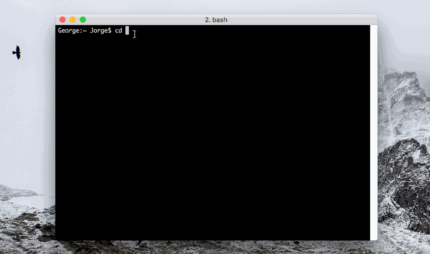

<p align="center">
	
</p>

<br />

### Repository index
- [Welcome to Dotfiles!](#welcome)
- [How to: Installation Guide](#install)
- [How to: Uninstall Dotfiles](#install)
- [Contribute to this repository](#contribute)
- [New to Dotfiles? Don't be panic!](#newbie)
- [Special thanks](#thanks)
- [Contact](#contact)


#<a name="welcome"></a>Welcome to Dotfiles!

Hi! Welcome to my dotfiles repository. I spent the last two days and half crafting and learning how to make my own dotfiles. I'm really proud of the result and can't wait to improve them and make more cool features in the following months. If you have some ideas, I'll be happy to open this repository to contributions (read ['how to make suggestions'](#contribute) below).

### What is a Dotfile?

According to <a href="http://drewbarontini.com/setup/dotfiles/" target="_blank">Drew Barontini</a>:
"Dotfiles is a name used to denote a set of configuration files (generally hidden ones with a `.` before the filename) that are used to set up and configure various applications and settings, such as: Bash. Git. Vim. Sublime Text"

### Goals with this repository

1. Crafting a program to install easily and comfortably all my mac applications, configuration files and design preferences (Dock, Finder...).
2. Analyzing why Dotfiles are so useful and learn how to make them properly.
3. Making the program easy to understand and open to modification (Chosing a good structure for future improvements and modifications).

#<a name="install"></a>Installation Guide

 



**Note:** Tested on Imac 2011 and Mac Book Pro Retina 2015.

### Installing Dotfiles


1. Open a Terminal. **⌘ + space** and type "**Terminal**" and enter.

2. Clone this repository on your local computer, for example in Documents directory.

	```Bash
	$ cd /Users/<your_username>/Documents
	$ git clone https://github.com/ferreiro/dotfiles.git
	```

3. 	Enter the cloned repository.

	```Bash
	$ cd dotfiles
	```

4. 	Run the main script.<br />
	*During the process it will ask you at least 2 times your password.*

	```Bash
	$ ./install.sh
	```

	
5. You will be promted to enter your password to execute the script as Super User (sudo)<br />
	*Note: Sometimes you may need to type password  again later*

	```Bash
	$ password: <yourUserPassword>
	```
	
### Uninstalling Dotfiles

> **Warning:** I am currently working on this feature and is not 100% finished. So only execute it if you have some experience with Dotfiles and understand the code.

1. Go to the main path of dotfiles. (Following previous steps)

	```Bash
	$ cd /Users/<your_username>/Documents/dotfiles 
	```
	
2. Run the uninstall.sh script

	```Bash
	$ ./uninstall.sh
	```
	
3. You will be promted to enter your password (this is done to execute the script as sudo - super user)

	```Bash
	$ password: <yourUserPassword>
	```

********

# <a name="contribute"></a> Contribute

I started this repo as a personal project, but If you have some ideas, I'll be happy to open this repository to contributions. You can use most of the scripts and file's structure to your own Dotfiles.

Suggesting new features can be done by [opening a new Issue](./issues) explaining the functionality.

To include your modifications and improvements on the current project, [propose a pull request](./pulls).
 

# <a name="newbie"></a> New to Dotfiles? Don't be panic!

I know that feeling. You are starting to see all that strange bash scripts and folders and you don't know what's going on. Don't be panic, all of us had felt something like that at certain point ;). I recommend you start by reading these articles (they helped me a lot):

- <a href="https://medium.com/@webprolific/getting-started-with-dotfiles-43c3602fd789#.cpj2cfs2r" target="_blank">Getting Started With Dotfiles</a> is an awesome Medium Post that I strongly recommend you to understand how Dotfiles are structured and how do they work. I followed this post to create this repository.
- <a href="https://dotfiles.github.io" target="_blank">Unofficial Guide to Dotfiles on Github.</a> Great online guide to with a bunch of useful links to get started.
- <a href="https://github.com/Ferreiros-lab/popular-dotfiles.git" target="_blank">Popular repositories by Jorge</a>. List of useful Dotfiles Github repositories I created to try them out and get Ideas from.

#<a name="thanks"></a>Special thanks

I want to give special thanks to some amazing developers who shared publicly their Dotfiles and letting the community to learn from their work. Thanks to them I've learned to make my Dotfiles even better. I strongly recommend you to check their repositories.

**@webprolific**. 'Getting Starting With Dofiles' article was made by this developer. I used their dotfiles as the base or my own ones. I think his Dotfiles are really well structured and also has some interesting features (like running only specific parts of your Dotfiles instead the whole program).Check his <a href="https://github.com/webpro/dotfiles" target="_blank">dotfiles repository</a>.

**@mathiasbynens**. Mathias created one of the most awesome Mac "defaults" scripts out there. His <a href="https://github.com/mathiasbynens/dotfiles" target="_blank">dotfiles repository</a> contains some cool code snippet that I strongly recommend you to check them out.

#<a name="contact"></a>Contact

If you have some doubts or want to stay in touch, I'll be happy to help you out or collaborate on new projects. You can reach me here:

- **Website:** <a href="http://www.jgferreiro.com" target="_blank">Jorge Ferreiro</a>
- **Work email:** me *(AT)* jgferreiro *(DOT)* com
